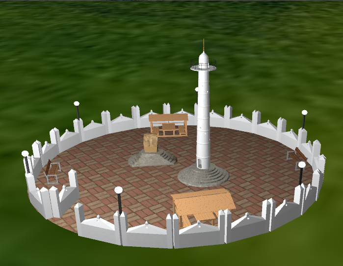
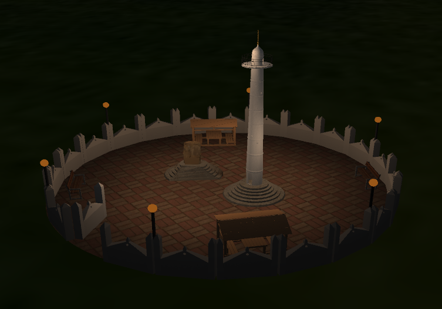

# 3D Modeling and Rendering of Dharahara using OpenGl

## Introduction

This is a Computer Graphics project done in the fifth semester of computer Engineering by:

- Sandeep Acharya
- Saujan Tiwari
- Sangam Chaulagain

## Libraries Used

- GLFW
- Glad
- Assimp

## Blender Model in Rendered View

## Output

### Day View

### Night View

## How to run

This project is only tested for 64-bit Windows 10 using mingw-w64 GCC.\
There are two batch files 'build.bat' and 'clean.bat' to automate the compilation process.\
build.bat is for building the project while clean.bat cleans .exe and .o files produced by build.bat

1. Open Command prompt.
2. Type build to build the project.
3. If the compilation is successful, 'output.exe' should appear in the project folder.
4. Click output.exe to view the output.

In case of linking errors, You probably need to build the libraries yourself.\
You can use cmake to buid the libraries.

### Helpful links

Mingw-w64: https://sourceforge.net/projects/mingw-w64/files/Toolchains%20targetting%20Win32/Personal%20Builds/mingw-builds/installer/mingw-w64-install.exe/download \
For building assimp: https://packages.msys2.org/package/mingw-w64-x86_64-assimp
